# Lens Studio UI Color Picker 
Lens Studio AR UI workshop for Snap Spectacles. Learn how to build an interactive UI step guide with a color picker that modifies objects using environment-based inputs. Created for ACAD207 (USC Snap Spectacles Class).

## What you'll make:

 An interactive experience where you will add a shape to the scene, change its size, and change the color of the object using your environment. 
- Allows you to use UI for user input to customize your experience

## Step 1 | Setup

### Open Project in Lens Studio 
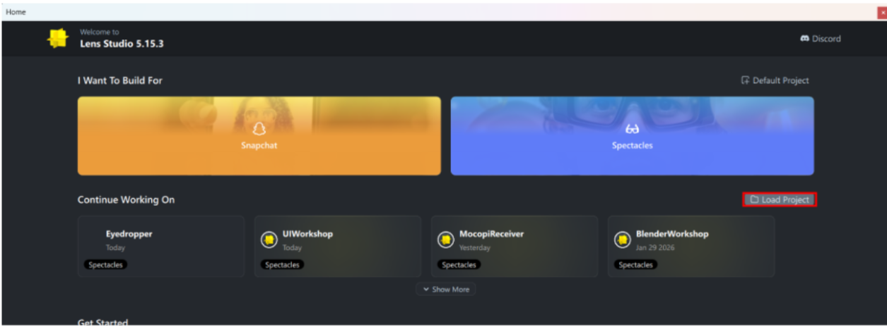
- After pulling this template, open Lens Studio. From the menu bar click on 'Load Project', and navigate to your ‘ACAD207 Projects’ folder, select the actual project file (.esproj), and open it.
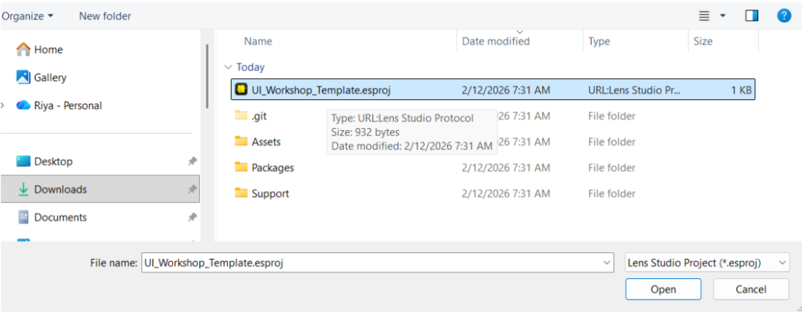
- Do not open the .esproj straight from your files
- After you have opened the project this way for the first time, you can subsequently open it through Lens Studio if you need to close and reopen the project.

## Step 2 | Adding UI Panels

### Downloading Latest Version of Interaction Kit:
-   First we need add the newest version of the Spectacles Interaction Kit examples to the project
-   Click on Asset Library, search up ‘SpectaclesInteractionKit’, and then the three dots, and then 0.16.4
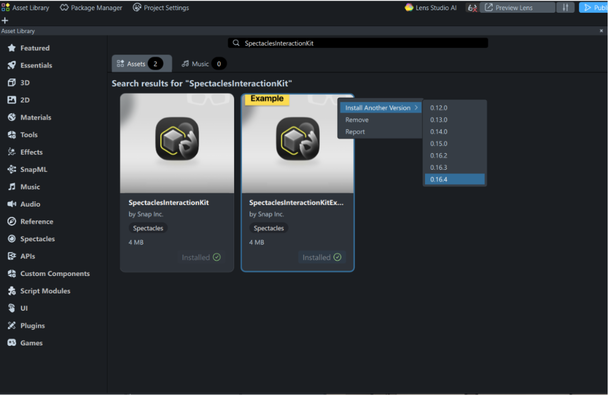
-    Since this template uses an older version of the InteractionKit, it will come up with a '2' next to it
		- When you create projects from the ‘Base Template’ or ‘Base Template with Examples’, you don’t need to do this
	 - This is only if you are modifying a template from online that may use an older version!
-   Drag the ‘SIK Examples’ from the ‘SpectaclesInteractionKit 2’ into the Scene
-   Open the SIK Examples up so you can see what’s in it. We will modify panels from the [EXAMPLES] UI Starter to make our own UI!

**NOTE:** You must add the newest version to the project! Otherwise some of the assets won’t show up and you will get missing materials!

### Setup Structure:
-   Now let’s make a Scene object called ShapeCreator that will hold our 3 panels
-   To do this, right click in the scene, click Create SceneObject
	- then right click on it, rename → rename it to ‘ShapeCreator’
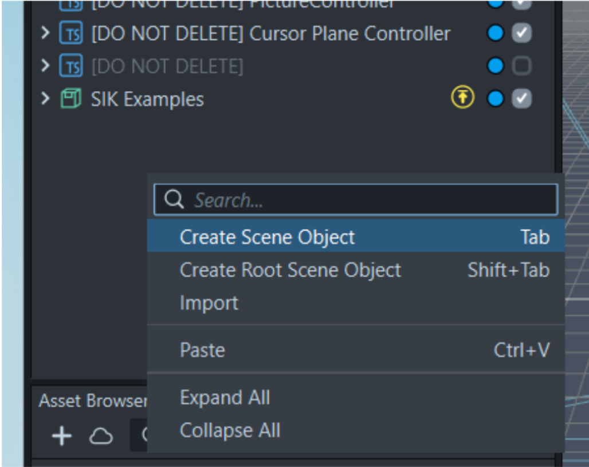
-  Now make three more Scene Objects inside ShapeCreator
-   Rename them ‘SpawnShapePanel’, ‘ChangeSizePanel’, and ‘ChangeColorPanel’ respectively.
-   It should look like this:
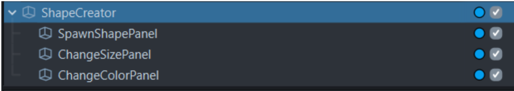
- Click on the checkbox next to SIK examples so it doesn’t block our view from what we are making. Feel free to toggle the visibility of objects throughout this assignment as needed
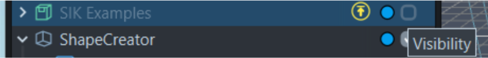

### Panel 1: Spawn Shape Panel
-   Now let’s make the following 3 Panels by modifying the UI from the SIK examples.
-   Find the ‘Toggle Group Layout Panel’, in the UI Starter
	-   right click to copy it
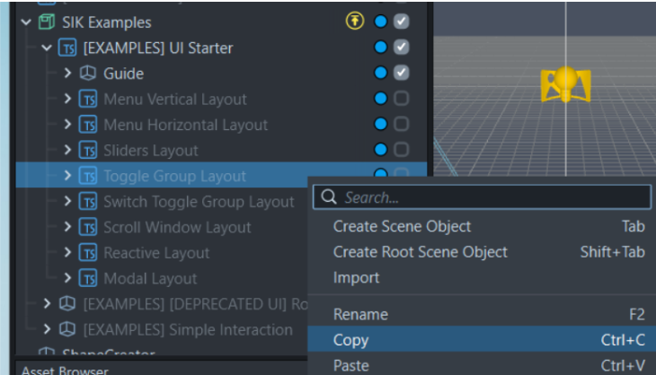
-   Click on the ‘SpawnShapePanel’ object that is inside of ‘ShapeCreator’ and right click paste
	-   Then click the check box next to ‘ToggleGroup Layout’ to see it
	-   A ‘Toggle Group Layout’ should now be inside of the ‘SpawnShapePanel’ object
	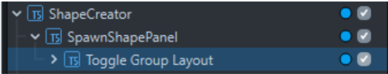
- Find the ‘Next’ object in Guide and copy it
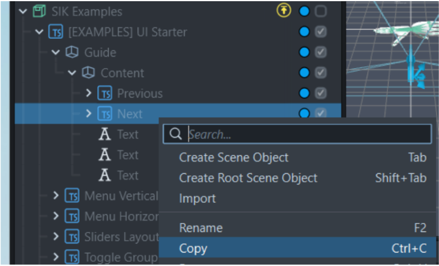
-   Paste the ‘Next’ button object into the ‘Toggle Group Layout’ inside of ‘SpawnShapePanel’
-   Your ‘ShapeCreator’ object should look like this now
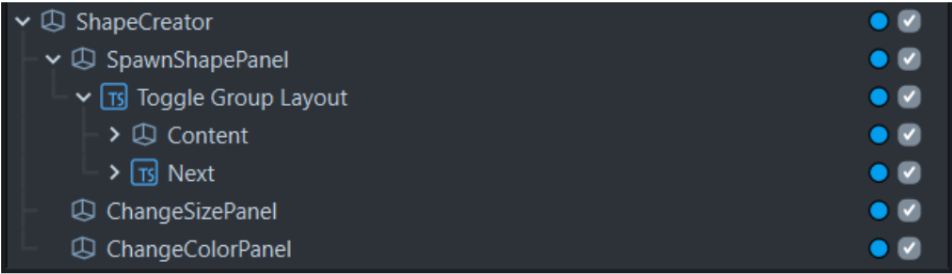
-   Now open up the ‘Toggle Group Layout’ object, keep clicking the drop down icon to see every single object inside. See what it is in the Inspector, so you know what it corresponds to in the Preview
-   Go through each item and modify it so that it looks like the panel below
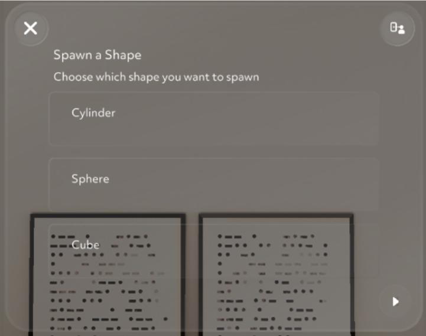

**TIP:**  You will need to
-   Modify the text values
-   Move the next button to the bottom right corner
-   (If you want) Play around with the Toggle Group Layout’s Frame component ‘Inner Size Value’ numbers to make it look better visually!
-   Feel free to adjust the UI how you’d like it
 
**TIP:** Rename the buttons to make it easier to assign them to scripts later on!
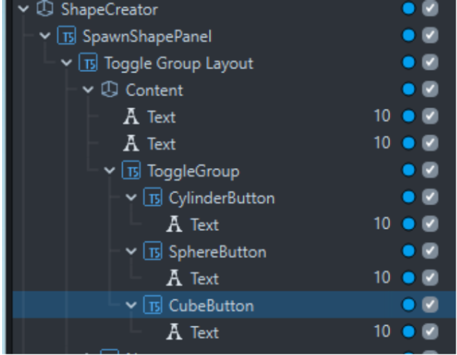

### Panel 2: Change Size Panel
-   Before we make the second panel, toggle the visibility (by unchecking the checkbox) of the ‘SpawnShapePanel’ so it’s not blocking our view for the next panel
-   Find the ‘Sliders Layout’ object in the UI Starter, and right click to copy it
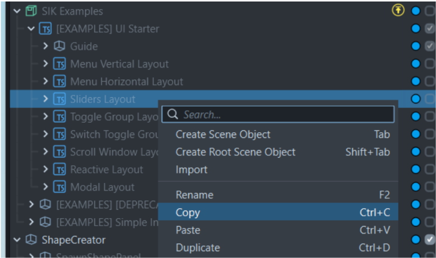
-  Paste this inside of ‘ChangeSizePanel’ inside of ShapeCreator. Make sure you toggle the visibility on so you can see it!
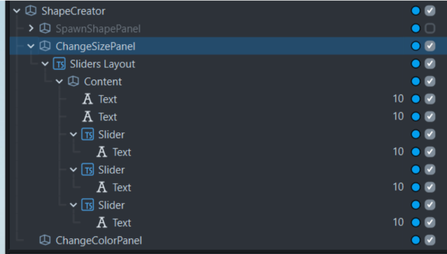
-   Add another ‘Next’ button to this panel. You can copy it from the SpawnShapePanel object
-   Now modify this panel so that it looks like the final panel below!
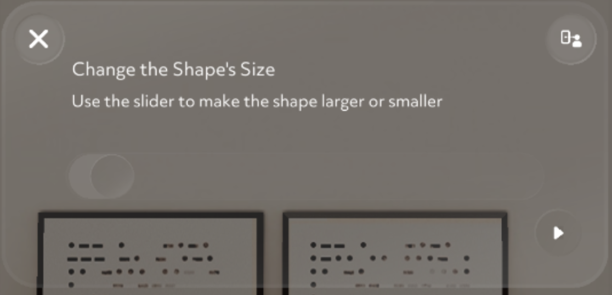

**TIP:** You will need to
-   Modify the text values
-   Delete two of the sliders, so that there is only one
-   Delete the ‘A, B, C’ text next to the sliders
-   Position the next button properly
-   (If you want) Play around with the Toggle Group Layout’s Frame component ‘Inner Size Value’ numbers to make it look better visually!
-   (If you want) Make the slider bigger to make it look better visually!

### Panel 3: Change Color Panel
-   Finally, let’s make the last panel! Remember to toggle the visibility of ‘ChangeSizePanel’ so that you can see only the final panel in preview easily
-   This one is a simple panel with text, just duplicate the ‘Toggle Group Layout’ from the ‘SpawnShapePanel’ or the ‘ChangeSizePanel’ and paste it into ‘ChangeColorPanel’
-   Modify the panel so that it just has three text fields positioned over the panel below
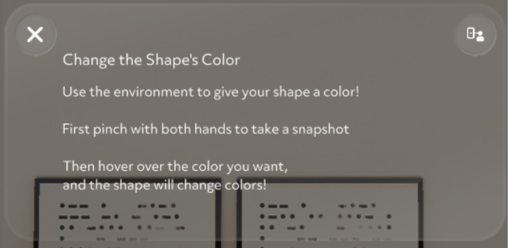

## Step 3 | Adding Meshes

### Adding Meshes
-   Now let’s add our 3 meshes to the scene, the cylinder, the sphere and the cube!
-   In the Asset Browser click on the plus (+) sign → then search for Box
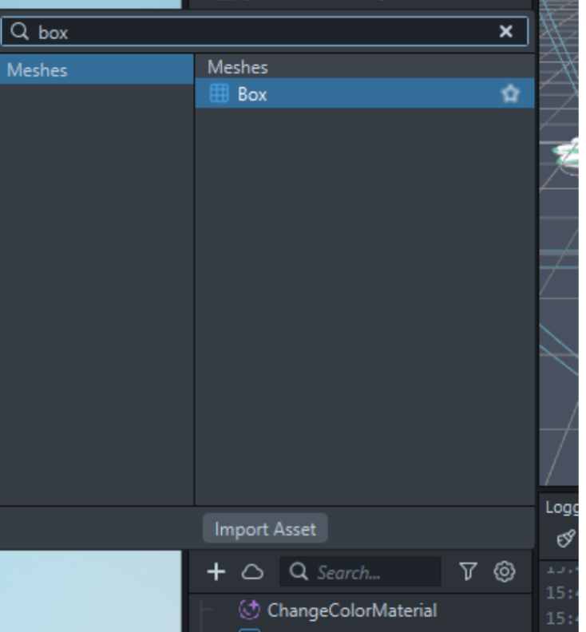
-    Then search for ‘BoxMesh’ in the AssetBrowser and drag the BoxMesh into the ShapeCreator panel 
-   Change the transform values so that the shapes are positioned right above the panel    
-   Here’s the transform values I used, if you’d like to use them
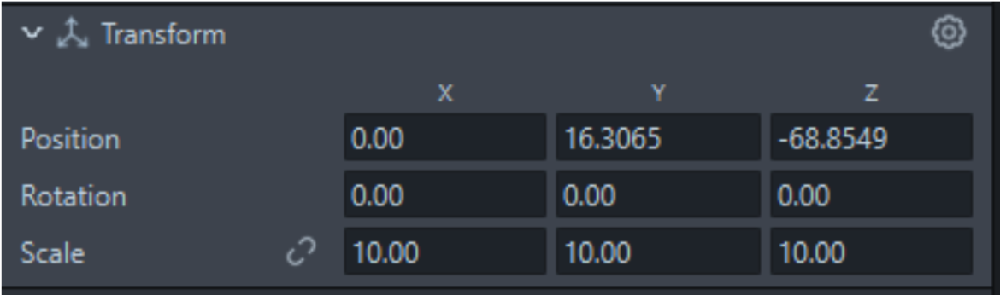
- Repeat the steps above for the Cylinder Mesh and the Sphere mesh

### Special Material for Meshes
-   In order to have our color changing functionality work, we need to add a specific material to it
-   Click on the BoxMesh in the scene
-   In the inspector, click on the Material 1 slot
-   Search for ShapeColorMaterial, click on it, and click OK
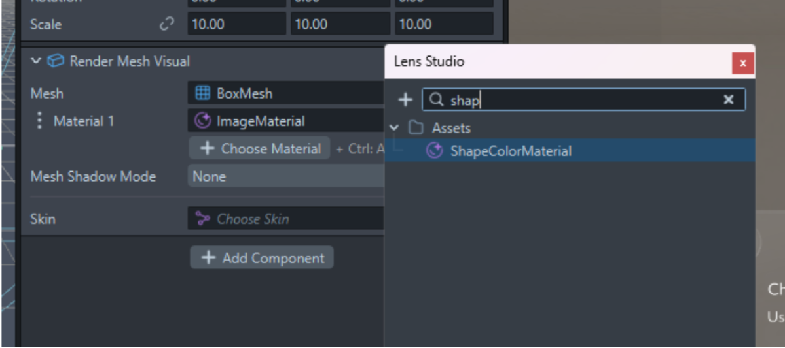
- Do the same for the Sphere mesh and the Cylinder mesh

**Note:** Before we start to add functionality, make sure all of your panels are visible

Your project should now look like the picture below, with overlapping panels and shapes above the panels. You won’t see the color changing until we add the functionality.

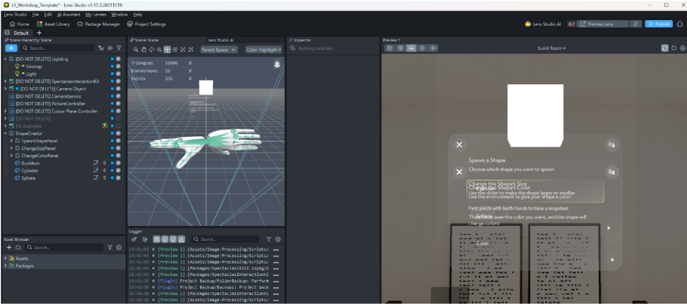

## Step 4 | Making Panels Functional
Now let’s add scripts to our objects so that it functions properly! All the scripts are provided in this project, so you won’t need to add any, but you will need to add them to the objects properly. If you are interested in the script functionality, I have commented on all of them, so feel free to read through and see what they do!

**Note:**  Your preview will pause when you add scripts that need to have objects assigned to them. Make sure you follow the instructions closely to assign all the parameters otherwise the project wont compile

### ColorPickerController
The color changing functionality is based on some functionality from this Spec Developers blog, read about it here if you’d like! [https://armandsumo.com/posts/eyedropper-for-spectacles-ar-glasses/](https://armandsumo.com/posts/eyedropper-for-spectacles-ar-glasses/)

-   Click on the ‘ShapeCreator’ object
-   In the Inspector, click the ‘Add Component’ button and add ColorPickerController
-   For Sample Color Indicator slot, click on it, search for ‘Sample Color Indicator’, select it,and click OK    
-   For Spawn Shape, search up SpawnShape and add that
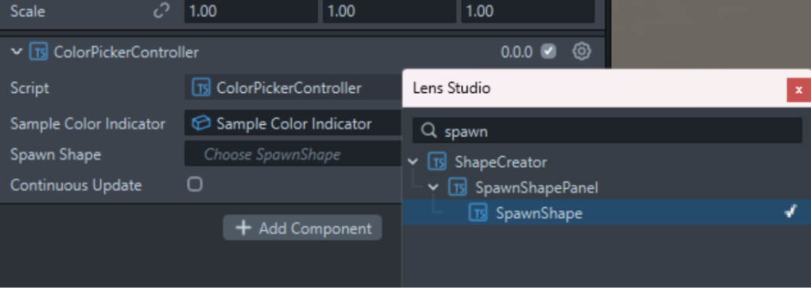
-  Make sure 'continuous update' is checked  
-   Should look like this
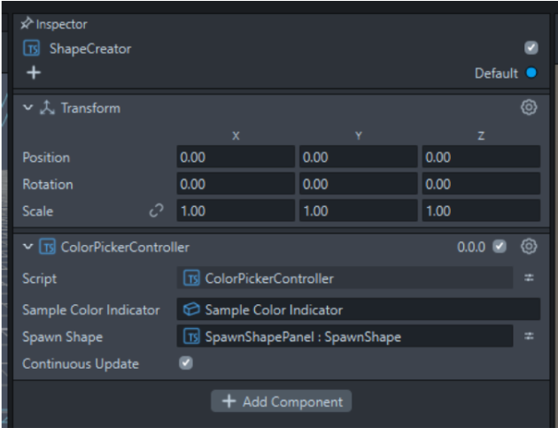

### Changing Size Functionality
-   Next let’s add functionality for the ‘ChangeSizePanel’ so click on it next
-   In the Inspector, add the ‘SliderScaleController’ component
-   Drag your slider inside of the ‘ChangeSizePanel’ to the slider slot
-   It should look like this
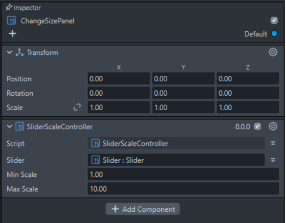

### Choosing Shape Functionality
-   Now Select the ‘SpawnShapePanel’
-   In the Inspector add the ‘SpawnShape’ script component
-   In the ‘Cylinder Mesh’ slot, search for Cylinder, and select its render mesh visual. Do the same for the other meshes
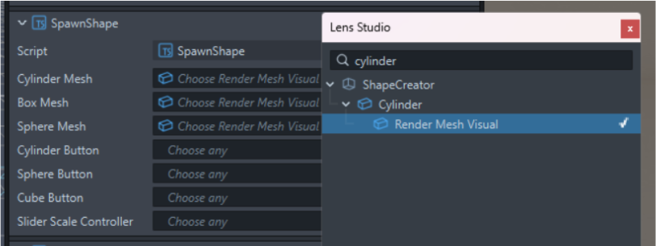
-    For the Button Holders, add the buttons you added in the Spawn Shape Panel
		-   Having trouble finding them? It will help to go back to the buttons inside ‘SpawnShapePanel’ and rename them to CylinderButton, SphereButton and CubeButton
-   For the slider parameter, search for ‘SliderScaleController’ and add that
-   Your SpawnShape component should look like this:
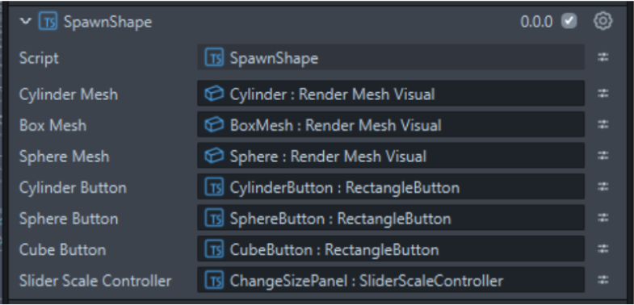

**Now on the same SpawnShapePanel, click Add Component and add ‘PanelNavigator’**
-   Drag the panels we made into their respective inputs
-   In ‘Next Button’, drag the Next Button from ‘SpawnShapePanel’
-   In ‘Next Button 2’, drag the Next Button from ‘ChangeSizePanel’
-   For Color Picker Controller, search for ColorPickerController and add it
-   The PanelNavigator component should look like this
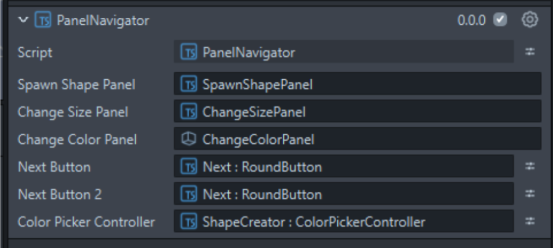

**Now refresh your Preview, and your project should compile! You can test the first two panels in editor, but to see the color changing effect you have to launch to your Spectacles (See Step 5)**

**Note:** If your project Isn’t compiling:
-   Review the images of the component, and make sure your scripts are all assigned just like the images
-   Read the logger, it will tell you what component isn’t “awake” yet, meaning the parameter needs to be assigned
-   Make sure you have assigned ALL of the scripts in this part
- Refresh preview

##  Step 5 | Testing it out & Submission

### Testing it out:
-   Your lens should now work! Please note the color changing only works in the Spectacles, not in the preview in Lens Studio
-   Test it out by connecting your Spectacles and clicking the Preview lens button
-   Watch the demo video to see how to do the pinching mechanic required for changing color

### Recording a Video:
-   Record a video by clicking the button on top of the left side of your glasses. Click it again once you are done recording.
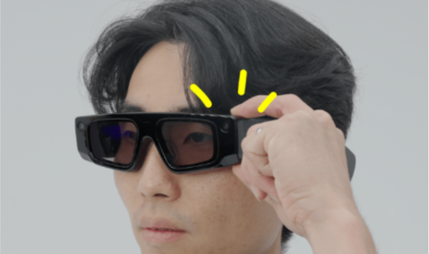
- Then open the Spectacles app. There will be a popup saying the video is ready to be downloaded in the app. The video will save to your phone’s camera roll

**Note:** Keep your Spectacles turned on while it’s downloading, mine had some issues where the video failed to download and I had to rerecord…

**What to Submit:**
-   Submit the video recording to Brightspace of your working lens in the Spectacles

##  Bonus/Challenge (Optional)
-   3D Challenge: Change the cylinder shape to a Star, and the sphere to a heart
-   Make the meshes in Blender and then import them. Make sure to add the correct ShapeColorMaterial to them!
-   Scripting Challenge: Add functionality to pinch to select a color, instead of the color changing by hover only    
-   UI + Scripting Challenge: Add a back button for the panels and make them functional
-   Hint: Duplicate the Next button and rotate it. And then modify the PanelNavigator script
-   UI + Scripting Challenge: Add a slider to rotate the object and make it functional!
-   UI Challenge: The ‘X’ buttons are not necessary for this project, delete them to make the UI look cleaner!
-   Right now you can make the shape extremely big. Modify the boundary in editor using SliderScaleController
-   Make the shape interactable, so you can move it around
-   **Hint:** the SIK Example Project has a ‘Simple Interaction’ example you can look through. See what components are on the object!
